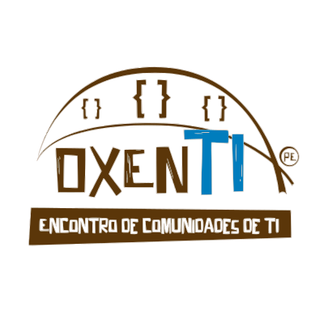

<h1 align="center">
  
   Eventos
</h1>
<h4 align="center">Repositório de meetups, eventos, encontros ou qualquer outra coisa 
que esteja acontecendo na comunidade pra juntar a galera!</h4>

<!-- inserir badges de membros, organizadores, contribuidores, organizadores, etc. -->

<!-- espaço para descrever quem somos -->

O _oxenTI-PE_, é um projeto que nasceu da necessidade de unir e centralizar a comunidade de desenvolvedores de Pernambuco.

## Como funciona

Se você tem algum evento (seja você um participante ou mesmo criador) pode adicionar [aqui](CONTRIBUTING.md), seguindo um template básico que vamos descrever logo abaixo.

### Quero participar!

É só nos seguir em nosso [Slack](https://oxentipe-slack-invite.herokuapp.com/), estaremos divulgando por lá as informações dos próximos encontros na comunidade.

### Quero palestrar!

Se sente à vontade e quer apresentar uma idéia bacana? Achou algo legal e quer compartilhar com a galera? Tem um bug ou situação que aprendeu muito e quer ajudar a comunidade? Ou quer levar uma tecnologia ou metodologia pro pessoal discutir?

Envie algumas informações pra gente através [desse link](#) e assim entraremos em contato para verificar sua disponibilidade na data do evento.

<!-- espaço de agradecimentos com lista dos organizadores -->
<!-- redes sociais "Nos acompanhe" -->

## Contribuindo

Contribuições sempre são bem vindas!

Se você tem alguma idéia, uma melhoria, estamos sempre abertos para discussão, é só chamar na issue e bora discutir! 

<!-- apoiadores -->
